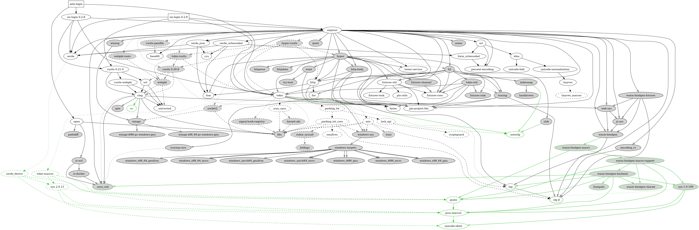

# eelu-login

eelu-login is a command-line tool that allows staff and students to log in to the Egyptian E-Learning University Moodle platform quickly and easily through the command-line interface.

[](https://crates.io/crates/eelu-login)
[](https://docs.rs/eelu-login)
[](https://crates.io/crates/eelu-login)
[](https://github.com/0x61nas/eelu-login/blob/aurora/LICENSE)

> This is a fork of [Crypt00o/eelu-login](https://github.com/Crypt00o/eelu-login) with more features and improvements and bugs =D

## Installation
You can install the latest stable version of eelu-login via Cargo:
```sh
cargo install eelu-login
```

Or you can get the latest git version from the repository:
```sh
cargo install --git https://github.com/0x61nas/eelu-login.git
```

Or you can install it from the AUR with your favorite AUR helper:
```sh
yay -S eelu-login # or any other AUR helper you use
```

## Usage
`eelu-login --help` will show you the usage of the tool:
```
[+] Usage : eelu-login [--user <username>] [--pass <password>] [--type <staff| sys-user | student>]
Args:
[-user | --user | --username | -username |  -u]   <username>  :  username to login with
[-pass | --pass | --password | -p]   <password>  :  password to login with
[-type | --type | --usertype | -usertype | -t]  : <usertype>

Flags:
[-o | --open | -open] : open browser after login
[-v | --verbose | -verbose] : verbose mode
[-V | --version | -version] : print version
[-h | --help | -help] : print this help message

usertype can be :
    [ staff | 3 ] for staff privilege
    [ sys-user | 1] for system user privilege
    [ student | 2] for student privilege"#
```

Replace `<username>` and `<password>` with your EELU Moodle login credentials, and `< staff | sys-user | student>` with your user type.

If you don't want to enter your credentials every time you run the tool, you can set the `SIS_EELU_USERNAME` and `SIS_EELU_PASSWORD` environment variables to your username and password respectively.

You can don't need to specify the user, and the tool will be try to login as a student and if it fails it will try to login as a staff and if it fails it will try to login as a system user.

## Dependency graph
genetated with [cargo-depgraph](https://crates.io/crates/cargo-depgraph)


## Contributing
If you want to contribute to this project, please read the [contributing guidelines](./CONTRIBUTING.md) first.

## Also available on
* [GitHub](https://github.com/anas-elgarhy/eeu-login) (main repo)
* [GitLab](https://gitlab.com/anas-elgarhy/eelu-login)
* [BitBucket](https://bitbucket.org/anas_elgarhy/eelu-login)
* [Codeberg](https://codeberg.org/anas-elgarhy/eelu-login)
* [Notabug](https://notabug.org/anas-elgarhy/eelu-login) (not instant updated)
* [disroot](https://git.disroot.org/anas-elgarhy/eelu-login)

## Useful Links
- [sis-login crate](https://crates.io/crates/sis-login)
- [EELU SIS](https://sis.eelu.edu.eg/)
- [EELU Moodle](https://moodle.eelu.edu.eg/)

License: MIT OR Apache-2.0
